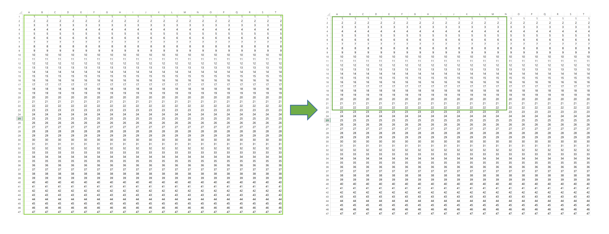
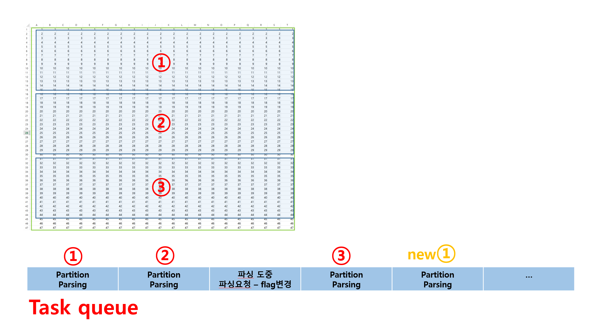

#When use this example?

연두색 영역을 셀렉션이라 가정하면 
셀렉션이 일어날때마다(mouse move, click keyboard down 등)
setTimeout을 이용하여 callback(cb) function을 호출한다. 
여기서 cb는 영역에 해당하는 숫자들의 평균, 덧셈, 개수 등등의 정보를 얻기위한 과정을 거치는 로직이 있다.

~~~~
var timer = setTimeout(parseCell, delay);

function parseCell() {
 //loop를 돌면서 평균,덧셈,개수,최대,최소 등등의 값을 구하거나 필요한 값을 찾는다.
 } 
~~~~

####**mouse move는 굉장히 빈번히 일어날텐데 이때 setTimeout을 발생수 만큼 호출을 하는가? 에 대한 정리**

 * http://fitzgeraldnick.com/2011/03/08/javascript-timer-congestion.html
 
 결국 수많은 mouse move의 setTimout 호출에도 불구하고 
 마지막에 들어온 range를 바탕으로 parseCell을 호출하게 될 것인데
 이때 파싱을 하던 중 다시 파싱요청이 들어왔다면?
 
 즉시 파싱을 멈추고 새로운 요청을 처리해야 한다. 
 
 하지만 setTimeout의 cb은 browser 영역에서 비동기적으로 처리하고 컨트롤을 뺏겨(?) 버렷기때문에
 중간 stop이 불가능하다.
 
 ####**자바스크립트 엔진과 callStack, Event loop, Queue를 자세히 설명한..**
 
 * http://sculove.github.io/blog/2018/01/18/javascriptflow/
 
  ~~~~
  // 새로운 flag를 기본 false로 선언한다.
  // 파싱중에 파싱요청이 들어온다면 이 flag를 변경해야 할 것이다.
  var cancelFlag = false;  
  ~~~~
  
  cancel flag 를 감지하여 파싱 도중에 멈추고 싶을때는
  파싱 영역을 나누어 setTimeout을 실행시키면 된다.
  
  

빨간 3에 실행되는 시점의 파싱 콜백함수는 cancel flag 를 감지 할 수 있고
이때 다음영역에 대한 부분파싱의 타이머를 실행시키지 않는다.

